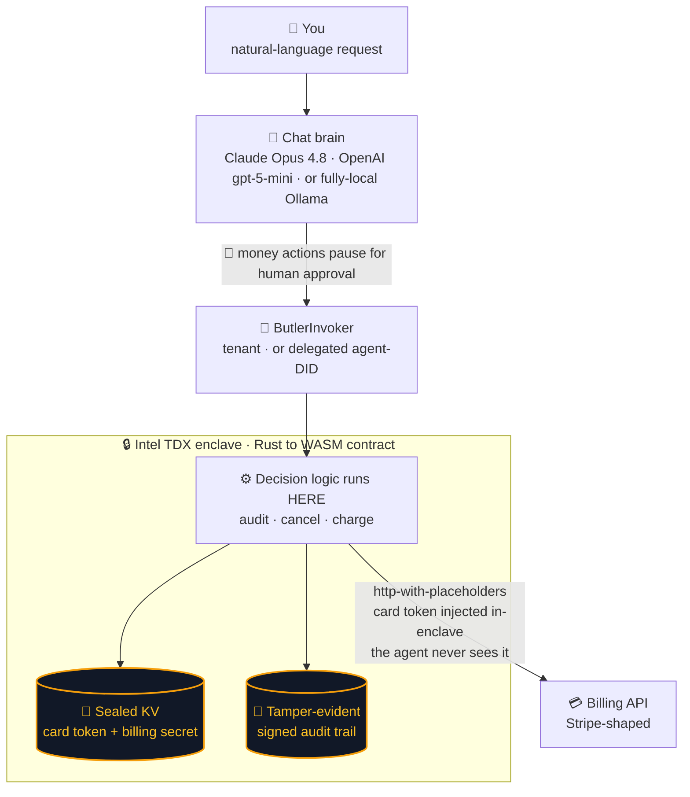

<div align="center">

# 🛎️ Subscription Butler

### An AI agent that spends your money — *without ever seeing your card.*

A privacy-first agent on the **Terminal 3 Network (T3N)** that audits, cancels, and pays your subscriptions — while the card token and billing credential stay **sealed inside an Intel TDX enclave**. The agent orchestrates real money movements without ever holding the secrets that authorize them.

<br/>


</div>

---

|  |  |
|:--|:--|
| 🔐 **Secret custody** | Card token + billing secret sealed inside an Intel TDX enclave — the agent never holds them. |
| 🤖 **The brain** | Swappable: Claude Opus 4.8, OpenAI gpt-5, *or* a fully-local Ollama model — human-gated on every money action. |
| 🧾 **Audit** | Every action signed in-enclave (secp256k1) and verifiable offline — no trust in the transport. |
| 🌐 **SDK depth** | 9 Terminal 3 primitives wired end-to-end on testnet. |

> [!IMPORTANT]
> **The whole idea in one line:** the agent has *authority to act* on your money but *zero custody* of the secret that authorizes it. Custody lives in the enclave; the decision lives in the agent; neither alone can leak or misuse your card.

---

## 🎯 The idea in one sentence

You tell the Butler *"cancel my unused subscriptions and pay the keepers"*; it reasons over your real subscription data inside the enclave, calls a Stripe-like billing API with your card token **injected by the enclave at send time**, and writes a tamper-evident audit trail — and at no point does the orchestrating agent (or you, or Terminal 3) hold the plaintext secret.

## 💡 Why this matters

Managing subscriptions today forces a bad trade. Either you hand an aggregator (Rocket Money, Truebill) full read/write access to your bank and cards — it sees everything, forever — or you do the toil by hand. There has been no way for software to *act on your money* — pay a keeper, cancel dead weight — without first being trusted with the secrets that authorize those actions.

Subscription Butler shows the third option T3N makes possible: **custody of the secret and authority to act are split.** The agent reasons and decides but never holds the card token; the enclave holds the token but never decides on its own. Authority without custody on one side, custody without autonomy on the other. That is the property regulated finance actually requires — and it's why this design maps onto real payment rails with no change to the privacy core (see [From mock to production](#from-mock-to-production)).

## 🔐 What makes the secret safe

The card token and billing API secret live in the enclave KV map `z:<tid>:butler-secrets`, seeded by the tenant SDK before the contract ever runs. The Rust→WASM contract reads them **inside the TDX enclave** and puts them into the outbound HTTP request from enclave memory. Two privacy mechanisms are demonstrated:

1. **Enclave-held secrets** — the billing `Authorization` bearer and the `cardToken` are read from sealed KV inside the contract. The agent process passes neither; the mock billing server proves they arrived by returning `paidWith: "tok_••••4242"` (a masked echo), and rejects any token that doesn't match the stored one (`402 card_declined`).
2. **`http-with-placeholders`** (T3N's flagship feature) — when a charge requests an emailed receipt, the contract templates `{{profile.first_name}}`, `{{profile.last_name}}`, and `{{profile.verified_contacts.email.value}}` into the request body. The **host resolves them from the calling user's profile at dispatch time**, so the user's PII never enters WASM memory. The receipt email comes back masked (`s•••@gmail.com`).

---

## 🏗️ Architecture



<sub>Plain text: **You → chat brain → invoker → enclave contract → billing API**. The secret never leaves the enclave; the agent only ever sees masked echoes.</sub>

### 🧩 SDK primitives exercised — *the integration-depth checklist*

| ✓ | Primitive | Where |
|:--|:--|:--|
| ✅ | **DID + API-key auth** (SIWE-style) | `src/t3n.ts` |
| ✅ | **Tenant KV maps** — `butler-secrets` + `butler-audit`, ACL-locked to the contract id | `src/ops/deploy.ts` |
| ✅ | **Seed secrets into KV** — control-plane `map-entry-set` (bypasses the writers ACL) | `src/ops/deploy.ts` |
| ✅ | **TEE contract (Rust→WASM)** — audit/cancel/charge/log run inside the enclave | `contract/` |
| ✅ | **Outbound HTTP** from the enclave (`host:interfaces/http`) | `contract/src/billing.rs` |
| ✅ | **`http-with-placeholders`** with `{{profile.*}}` markers | `contract/src/billing.rs` |
| ✅ | **User-authorized egress** — `agent-auth-update` allowlists the billing host | `src/ops/grant.ts` |
| ✅ | **Scoped delegation** — separate agent DID; granted audit/cancel/log but **not** charge | `src/ops/agent-setup.ts` |
| ✅ | **On-chain audit trail** — read back via `get-audit-log` | `contract/src/audit_log.rs` |

---

<details>
<summary><b>📦 Repository layout</b></summary>

<br/>

```
contract/                 Rust → WASM TEE contract (the privacy core)
  src/lib.rs              4 exported functions + the generic-input envelope
  src/audit.rs            pure audit engine (dead-weight / duplicate / budget) — host-testable
  src/billing.rs          enclave billing client; reads sealed KV; http + placeholders
  src/audit_log.rs        tamper-evident audit trail, enclave-SIGNED per entry (v2 format)
  wit/                    world.wit (+ a no-signing fallback world) + vendored host WIT deps
src/
  t3n.ts                  testnet auth → { t3n, tenant, tenantDid }
  billing/                mock Stripe-like billing API (Hono) + tests
  ops/                    deploy / grant / invoke / logs / agent-setup / verify-audit CLIs
  agent/                  chat brain, tool surface, contract invoker,
                          LLM provider selection (Anthropic / OpenAI / local Ollama)
  audit/                  offline signature verification of audit entries (noble keccak+secp256k1)
  web/                    one-page web UI: SSE chat, approve/deny gate, live verified audit panel
```

</details>

<details>
<summary><b>⚙️ Prerequisites</b></summary>

<br/>

- Node ≥ 18, npm
- Rust + the `wasm32-wasip2` target (`rustup target add wasm32-wasip2`) and `wasm-tools`
- A tunnel tool (`ngrok` or `cloudflared`) so the enclave can reach the local billing API
- A T3N developer API key from the [claim page](https://www.terminal3.io/claim-page)
- (Optional, for the chat brain) an Anthropic API key, an OpenAI API key, or [Ollama](https://ollama.com) serving a tool-calling-capable local model

</details>

<details>
<summary><b>🚀 Setup &amp; run</b></summary>

<br/>

```bash
# 0. install deps
npm install
cp .env.example .env          # then paste T3N_API_KEY, set BILLING_API_SECRET / BILLING_CARD_TOKEN

# 1. build the contract
cd contract && cargo build --release && cd ..      # → contract/target/wasm32-wasip2/release/subscription_butler.wasm

# 2. start the mock billing API + a public tunnel, then record the tunnel URL
npm run billing                                    # terminal A  (http://localhost:8787)
ngrok http 8787                                    # terminal B  → set BILLING_PUBLIC_URL in .env

# 3. deploy: register the contract, create the KV maps, seed the secrets
npm run deploy

# 4. authorize outbound egress to the billing host (tenant self-grant)
npm run grant

# 5. drive it directly…
npm run invoke -- audit-subscriptions '{"monthly_budget_cents":5000}'
npm run invoke -- cancel-subscription '{"subscription_id":"sub_gym_app"}'
npm run invoke -- charge-subscription '{"subscription_id":"sub_netflix","idempotency_key":"demo-1"}'
npm run invoke -- charge-subscription '{"subscription_id":"sub_spotify","idempotency_key":"demo-2","email_receipt_to_profile":true}'
npm run invoke -- get-audit-log

# 6. …or chat (needs ANTHROPIC_API_KEY)
npm run chat
#   You: audit my subscriptions with a $50 budget and cancel the dead weight

# 6b. …or chat with OpenAI (gpt-5 family; reliable tool calling)
LLM_PROVIDER=openai OPENAI_API_KEY=... npm run chat    # defaults to gpt-5-mini; override with OPENAI_MODEL

# 6c. …or chat with a fully LOCAL brain — no cloud LLM ever sees your data
LLM_PROVIDER=ollama OLLAMA_MODEL=gemma4 npm run chat   # any tool-capable `ollama list` model

# 7. …or the web UI: chat pane, approve/deny buttons for money actions,
#    live audit trail with per-entry signature verification, and a
#    "what the agent never saw" evidence panel. Binds to 127.0.0.1 ONLY.
npm run web                                            # http://127.0.0.1:8788
LLM_PROVIDER=openai OPENAI_API_KEY=... npm run web     # same, OpenAI gpt-5-mini brain
LLM_PROVIDER=ollama OLLAMA_MODEL=gemma4 npm run web    # same, fully local brain

# 8. verify the audit trail offline (keccak256 + secp256k1 against the
#    public key embedded at write time — no trust in the transport)
npm run verify-audit -- --limit 20
```

### Enclave-signed audit trail (contract ≥ 0.2.0)

Every audit entry is serialized once to a canonical JSON `payload`, signed
**inside the enclave** via the host `signing` interface (Keccak-256 +
cluster secp256k1), and stored as `{v: 2, payload, sig}`. Readers re-parse
the payload, so what you display is exactly what was signed; `npm run
verify-audit` (and the web UI) re-verify every entry offline and flag any
tampering.

> [!WARNING]
> **Current-testnet caveat:** the cluster does not yet admit the `signing`
> capability for tenant contracts — a build importing it registers fine but
> every invoke returns HTTP 500 (filed as BUG-008/009). The crate therefore
> builds **without** the import by default; entries are stored in the same v2
> format with an explicit `sign_error` and the verifier reports them as
> UNSIGNED (never silently "ok"). Once admitted, rebuild with
> `cargo build --release --features enclave-signing` and redeploy — nothing
> else changes.

### Scoped delegation (optional)

```bash
npm run agent:setup          # creates the agent's own DID, writes AGENT_T3N_KEY + AGENT_DID
# grant the agent audit/cancel/log but deliberately NOT charge, alongside the tenant self-grant:
GRANT_FUNCTIONS=audit-subscriptions,cancel-subscription,get-audit-log npm run grant
```

The grant is written on-chain. Running the agent as its own principal end-to-end is currently blocked by a testnet faucet limitation — see **Known limitations**.

</details>

<details>
<summary><b>🧪 Tests</b></summary>

<br/>

```bash
npm test                                   # billing + brain + Ollama + verifier + web session/app (91 tests)
npm run typecheck                          # tsc --noEmit

# Contract tests run on the HOST target — the crate defaults to wasm32-wasip2
# (see contract/.cargo/config.toml), which can't execute native test binaries:
cd contract && cargo test --target "$(rustc -vV | sed -n 's/host: //p')"                            # 32 tests
cd contract && cargo test --target "$(rustc -vV | sed -n 's/host: //p')" --features enclave-signing # same, signing build
```

The chat-brain tests drive the agentic loop with a **scripted fake model** (no API key, no network) and assert the load-bearing behavior: read-only tools run without confirmation, mutating tools are gated, denials and contract errors are fed back to the model as `is_error` tool results, and the tool loop is bounded.

</details>

<details>
<summary><b>🛡️ Production-hardening notes</b></summary>

<br/>

This is a hackathon entry, but the failure modes are handled deliberately:

- **Inputs validated, fail closed.** Subscription ids and idempotency keys are charset/length-checked before they reach a URL or header (`contract/src/types.rs`). Out-of-range prices, unknown cadence/status, and NaN usage scores are rejected or clamped, never silently mis-totaled (`contract/src/audit.rs`).
- **Secrets never leak.** The billing secret/card token are never logged, never returned across the WIT boundary, and never echoed unmasked by the billing server. The request logger explicitly skips the `Authorization` header.
- **Idempotency.** Charges carry a caller-supplied `Idempotency-Key`; a retried charge never double-bills. Cancels are idempotent (`changed` reports whether this call did the work).
- **Honest audit semantics.** On a mutating call, the audit-log write commits in the same enclave tx; if it fails, the contract surfaces a precise `audit-write-failed` error rather than hiding that the upstream action already happened. On the read-only audit, a log-write hiccup is reported (`audit_entry_written: false`) but never costs the caller their report.
- **Bounded blast radius.** Upstream responses are size-capped before parsing (no OOM in WASM); the chat loop is bounded; no blind retries on mutations.

</details>

<details>
<summary><b>⚠️ Known limitations</b></summary>

<br/>

- **Agent-DID delegation can't be run end-to-end on testnet.** The on-chain scoped grant is written and verifiable, but a freshly-created agent DID has zero credits, and the only funding paths (claim page, in-SDK self-admit) require interactive email-OTP — there is no headless way to fund it. Delegated calls bill the agent DID, so a funded tenant can't carry it. Filed against the Bug Discovery track (BUG-005). The Butler therefore runs as the funded **tenant** principal by default; the delegation grant remains a real, inspectable artifact.
- **`agent-auth-update` is full-replace.** Each call replaces the caller's entire authorization document, so `npm run grant` always re-sends the tenant self-grant plus any agent grant together (BUG-007).
- **In-enclave signing is built but not admitted by the current testnet.** Importing `host:interfaces/signing` makes every invoke 500 (BUG-008) and a bad latest version takes the whole script down because dispatch ignores the requested version (BUG-009). The signed-trail pipeline (v2 entry format, offline verifier, UI badges) is fully implemented and tested against real secp256k1 signatures; the contract ships with the import behind the `enclave-signing` cargo feature until the cluster admits it.
- **The web UI is a local, single-session demo surface.** It binds to 127.0.0.1 and has no authentication of its own — the confirm gate, not the transport, is the security boundary it demonstrates. Don't expose it.
- **Billing API is mock.** It is the *only* mock in the project — a faithful but minimal Stripe-shaped stand-in. Everything that carries the privacy guarantee is real T3N. See [From mock to production](#from-mock-to-production) for exactly what each mock piece becomes on real rails and why the privacy core does not move.
- **Local-model tool calling is best-effort.** With `LLM_PROVIDER=ollama`, conversation quality depends entirely on the local model's tool-calling ability. The adapter defends the safety properties regardless (tool calls are gated on their *presence*, not the model's `finish_reason`; malformed tool JSON is retried once, then surfaced as a clear error) — but a weak model may simply call tools less competently than Claude.

</details>

---

## From mock to production

The only mock in this project is the **billing API** — a faithful Stripe-shaped stand-in for list / charge / cancel. Everything that carries the privacy guarantee — enclave-held secrets, in-enclave decision logic, `http-with-placeholders` injection, scoped on-chain delegation, the signed audit trail — is real T3N. Going to production replaces *one host endpoint and one set of seeded secrets*; the contract, the placeholder mechanism, and the agent's view of the world never change.

Here is what each mock piece becomes on real rails, and where the honest hard edges are.

| Capability | Mock today | Production rail | What changes in this codebase |
|---|---|---|---|
| **Hold a card credential** | `cardToken` seeded into KV | PSP **network token** (Stripe network tokens / saved payment methods, Adyen) — never the raw PAN | Seed the network token + PSP secret into `butler-secrets` instead of `tok_test`. Same map, same in-enclave read path. |
| **Charge a keeper** | `POST /subscriptions/:id/charge` | Stripe `PaymentIntents` / Adyen `/payments`, secret injected via `{{secrets.*}}`, token via the host placeholder | `contract/src/billing.rs` swaps the URL and body shape. Secret + token still enter from enclave memory; the agent still never sees either. |
| **Discover subscriptions** | 6 seeded rows | **Plaid** recurring-transactions / transaction enrichment, or the card networks' own merchant data | Replace the seeded list with a Plaid-access-token-authed fetch inside the contract (the Plaid token lives in `butler-secrets`). The audit engine in `audit.rs` is untouched. |
| **Cancel a subscription** | `POST /subscriptions/:id/cancel` | **Visa Subscription Manager** / **Mastercard subscription-control** to stop the recurring charge at the network; merchant subscription APIs where they exist | Same enclave call shape. The honest gap is below. |
| **Emailed receipt** | `{{profile.*}}` → mock server | PSP receipt API via the *same* `http-with-placeholders` call — PII still resolved host-side, never in WASM | No change. This is already the real mechanism. |

### The honest hard edges

- **Cancellation is not uniformly an API.** Network-level stop (Visa / Mastercard subscription-control) reliably halts the *charge*, but many merchants only honor cancellation through a logged-in flow on their own site — which is exactly why Rocket Money runs **human concierge** cancellations. A production Butler is therefore: network-stop where available → merchant API where it exists → human-in-the-loop concierge as the floor. The enclave/agent custody split holds for all three; the last one just adds a person to the loop, it does not hand them the secret.
- **Apple Pay can't be driven server-side.** An Apple Pay token (DPAN) is bound to the device's Secure Element. No server-side agent — in an enclave or not — can present it. That is an Apple architecture limit, not a T3N one. Production scope is card-on-file / network tokens; Apple Pay subscriptions stay on the device.
- **KYC and consent are real onboarding steps.** Funding a real card credential and authorizing network-level cancellation require verified cardholder consent. T3N's DID + scoped on-chain grant is a natural home for that consent record — the grant the Butler already writes (`src/ops/grant.ts`) is the skeleton of it.

### Why this is the Design-Partner pitch

Terminal 3's network is built for banks, governments, and enterprises that cannot let a vendor hold plaintext credentials. Subscription Butler is a working template for that constraint: a fintech can ship "an AI that manages your subscriptions" where **plaintext card data never touches its application servers** — the enclave holds it, every money action is human-confirmed, scoped by an on-chain grant, and signed into a tamper-evident trail. The PCI-DSS scope of those app servers collapses, because they never see a PAN. That is the conversation this entry is built to start.

---

<div align="center">

**Built for the [T3 ADK Bounty Challenge](https://dorahacks.io/hackathon/t3adkdevchallenge/detail)** · Agent Auth SDK track · runs on the T3N testnet

📄 Licensed under the **MIT License**.

</div>
